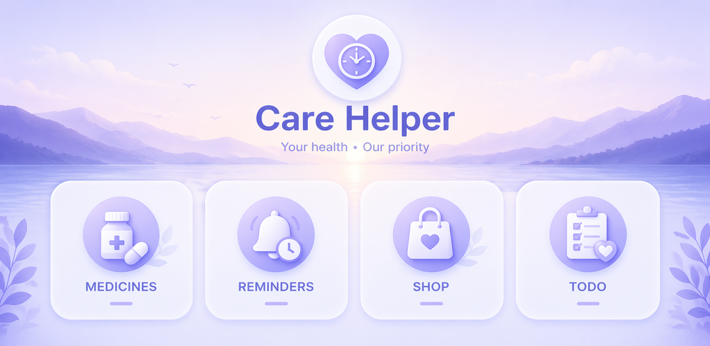
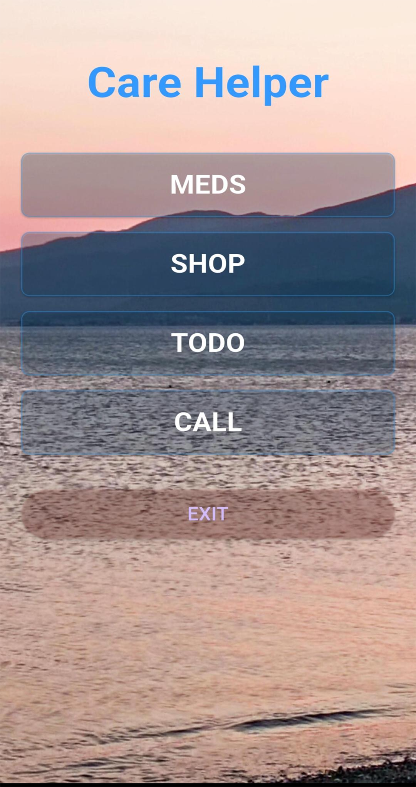
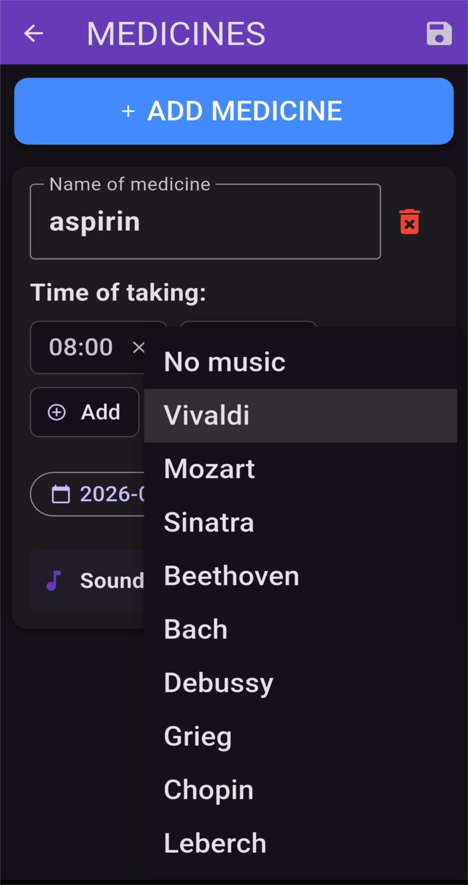
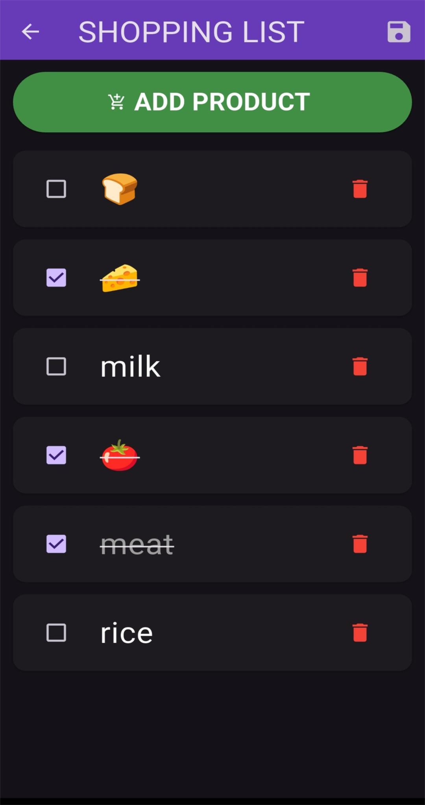
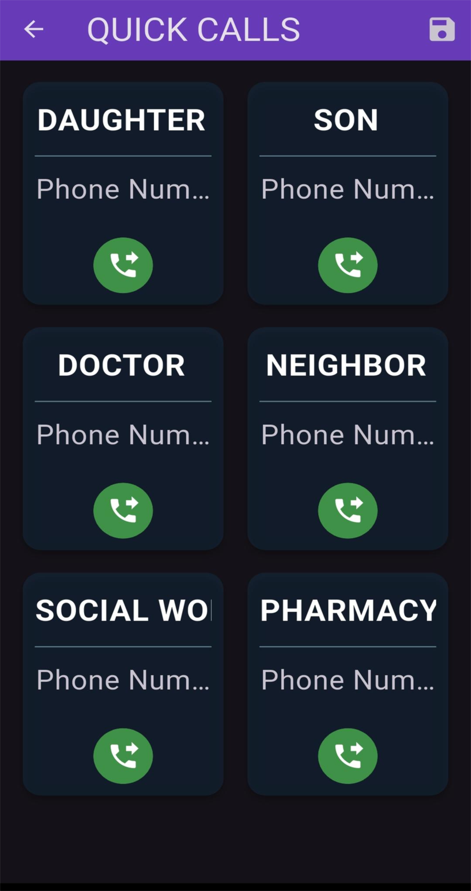

# Care Helper 🦾💊

<p align="center">
  
</p>

**Care Helper** is a caring and simple app designed to help people in their daily lives. It combines critical tools—medication management, shopping lists, to-do lists, and quick contacts—in a highly accessible interface.
**Care Helper** — это заботливое и простое приложение, созданное для помощи пожилым людям и их близким. Оно объединяет в себе критически важные инструменты: контроль приема лекарств, списки покупок, важных дел и быстрые контакты, упакованные в максимально доступный интерфейс.
**Care Helper** — це дбайливий та простий додаток, створений для допомоги людям у повсякденному житті. Воно поєднує критично важливі інструменти: контроль прийому ліків, списки покупок, важливих справ і швидкі контакти, упаковані в максимально доступний інтерфейс.
**Care Helper** es una aplicación sencilla y práctica diseñada para ayudar a las personas en su vida diaria. Combina herramientas esenciales —gestión de medicamentos, listas de la compra, listas de tareas pendientes y contactos rápidos— en una interfaz muy accesible.
---

## 🌍 Languages / Мови / Языки / Idiomas
[English](#english) | [Русский](#русский) | [Українська](#українська) | [Español](#español)

---

<a name="english"></a>
### 🇬🇧 English
**Essential assistance for daily health and routines.**
The app makes life easier by combining medication management, shopping lists, to-do lists, and emergency contacts.
* **Medication Alarms:** Reliable daily reminders with custom sounds.
* **Smart Lists:** Automatic focus and cursor management for effortless typing.
* **Quick Access:** Emergency and family contacts accessible with a single tap.
* **Modern Interface:** Fully optimized for Android 15 (Edge-to-Edge) and portrait-only mode for maximum stability.
* **Authentic Design:** Featuring a real sea photograph captured by the author as the background.

---

<a name="русский"></a>
### 🇷🇺 Русский
**Незаменимый помощник для ежедневного контроля здоровья.**
Приложение упрощает жизнь, объединяя контроль лекарств, списки покупок, важных дел и экстренные контакты.
* **Контроль лекарств:** Надежные ежедневные напоминания с выбором мелодий.
* **Умные списки:** Автоматическое управление фокусом и курсором для легкого ввода текста.
* **Быстрый доступ:** Связь с семьей и врачами в одно нажатие.
* **Современный интерфейс:** Оптимизация под Android 15 (Edge-to-Edge) и фиксированный вертикальный режим для удобства.
* **Авторский дизайн:** В качестве фона используется реальное фото моря, сделанное автором.

---

<a name="українська"></a>
### 🇺🇦 Українська
**Незамінний помічник для щоденного контролю здоров'я.**
Додаток спрощує життя, поєднуючи контроль ліків, списки покупок, важливих справ і екстрені контакти.
* **Контроль ліків:** Надійні щоденні нагадування з можливістю вибору мелодій.
* **Розумні списки:** Автоматичне керування фокусом та курсором для легкого введення тексту.
* **Швидкий доступ:** Зв'язок із родиною та лікарями в один дотик.
* **Сучасний інтерфейс:** Оптимізація під Android 15 (Edge-to-Edge) та фіксований вертикальний режим для стабільності.
* **Авторський дизайн:** Як фон використовується реальне фото моря, зроблене автором.

---

<a name="español"></a>
### 🇪🇸 Español
**Asistencia esencial para el control diario de la salud.**
La aplicación facilita la vida al combinar la gestión de medicamentos, listas de la compra, listas de tareas pendientes y contactos de emergencia.
* **Alarmas de Medicamentos:** Recordatorios diarios fiables con sonidos personalizados.
* **Listas Inteligentes:** Gestión automática del enfoque y el cursor para escribir sin esfuerzo.
* **Acceso Rápido:** Contactos familiares y de emergencia accesibles con un solo toque.
* **Interfaz Moderna:** Optimizado para Android 15 (Edge-to-Edge) y modo vertical fijo para mayor estabilidad.
* **Diseño auténtico:** El fondo es una fotografía real del mar tomada por el autor.

---
## 📸 Screenshots
<p align="center">
  
</p>

<p align="center">
  
  
  
  
</p>


## 🚀 Technical Details
* **Focus Management:** Custom `Map<String, FocusNode>` implementation to handle keyboard behavior on Xiaomi/Redmi devices.
* **Alarms:** Powered by `android_alarm_manager_plus` for precision background notifications.
* **UI/UX:** Fixed portrait orientation and `Edge-to-Edge` support for Android 15 (SDK 35).
* **Storage:** Local JSON-based persistence for user privacy and offline work.

## 🛠 Installation
1. Clone the repository.
2. Run `flutter pub get`.
3. Ensure exact alarm permissions are granted on Android 13+.
4. Run `flutter run`.

## 🛠 How to Clone & Run (Technical Guide)

```markdown
## 🛠 How to Clone & Run (Technical Guide)

If you want to run this project locally or contribute, follow these steps:
### 1. Clone the repository
```bash
git clone [https://github.com/ElmanSafarov1960/care_helper.git](https://github.com/ElmanSafarov1960/care_helper.git)
cd care_helper


### 2. Install dependencies
Make sure you have Flutter installed (`flutter doctor`). Then run:
```bash
flutter pub get
```

### 3. Setup Android Permissions
This app requires specific permissions for alarms and notifications. If you are testing on **Android 13 or 15**, ensure the following:
* Grant **Notification** permission on the first launch.
* Allow **Exact Alarms** in the system settings (usually found in App Info > Special App Access).
* Disable **Battery Optimization** for this app to ensure alarms trigger reliably.

### 4. Run the app
Connect your device (Redmi/Xiaomi recommended for testing focus fixes) and run:
```bash
flutter run
```

---

## 🏗 Project Structure
* `lib/screens/` — UI screens (Meds, Shop, To-Do, Calls).
* `lib/services/` — Logic for Alarms and Local Storage.
* `lib/models/` — Data structures (Medicine, etc.).
* `screenshots/` — Visual assets for documentation.
```
*Developed with ❤️ by Elman*


